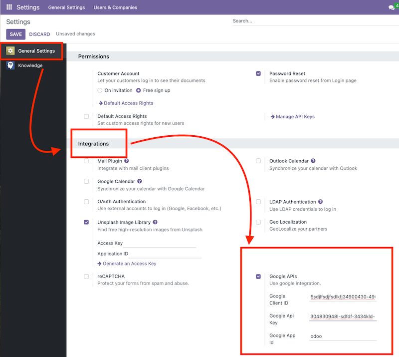

To configure this module, you need to:

- Go to Settings -> General Settings and scroll down to the Integrations section.

- Enable "Google API", save. Setup instructions https://developers.google.com/drive/picker/guides/overview

  - "Google Client ID" - enter the client ID from the Google API console: https://developers.google.com/identity/oauth2/web/guides/get-google-api-clientid
  - "Google API key" - enter the API key from the Google API console.
  - "Google App ID" - enter the ID of the Google application. The default value is
    `odoo`.

You will be asked to authenticate when you add a link for the first time.

**To modify your personal login credentials later**

- Open your user profile and set up personal access credentials on the "Google
  API" tab.

  - field "Google Scope" - enter the scope for the Google API. The default value is
    `https://www.googleapis.com/auth/drive.readonly`.
  - field "Google Access Token" - your token will be displayed here. It is necessary to
    edit it.
  - field "Google Mime Types" - enter the file formats to be filtered when selecting.
    Example: `application/pdf, image/jpeg, image/png`. By default, all files are
    selected

  You can always log off from the current Google Account by clicking the "logout" icon right to the "Add GDrive link".

