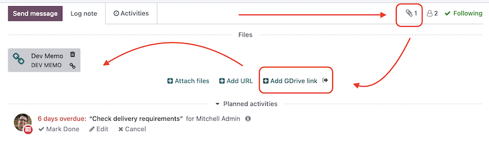

To use this module, you need to:

1. Open the form view of an object (Example: Customer Invoice INV/2019/0007).
1. Go to the chatter and click on the attached icon.
1. Click **Add GDrive link**.
1. Fill the wizard fields and click on Add button.
1. In the open window, select the files you need and press the select button.
1. You will see a new **URL attachment** in the set of attachments related to the object.
1. In order to log in under another google user, click on the logout icon located after **Add GDrive link**

